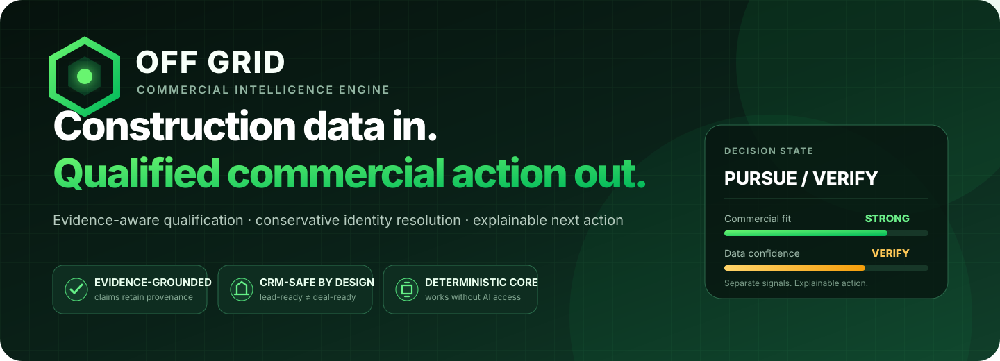
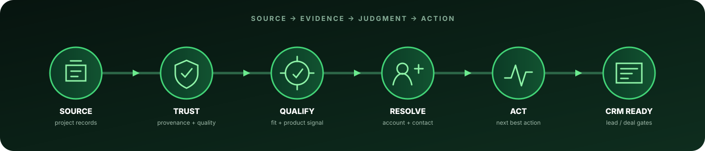
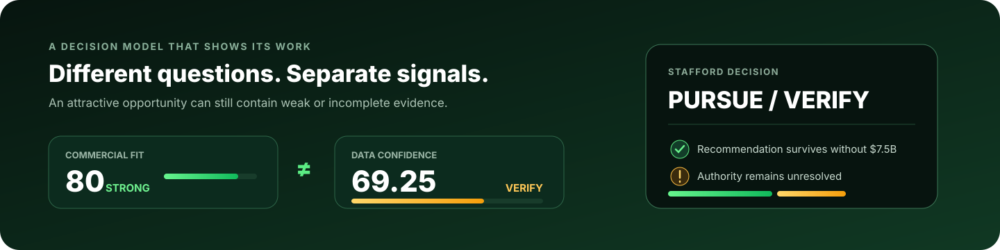
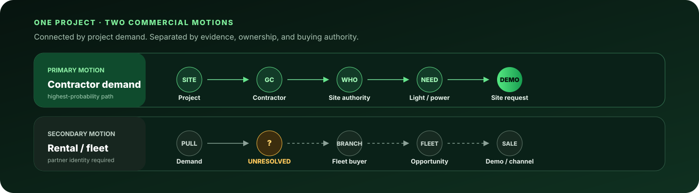
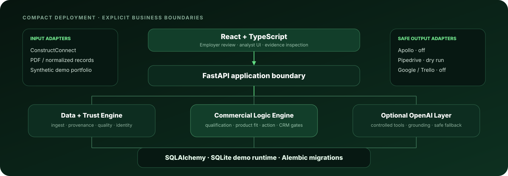

<div align="center">
  
</div>

<br />

<p align="center">
  <a href="https://www.python.org/"></a>
  <a href="https://fastapi.tiangolo.com/"></a>
  <a href="https://react.dev/"></a>
  <a href="https://www.typescriptlang.org/"></a>
</p>

<p align="center">
  <a href="https://www.docker.com/"></a>
  <a href="https://aws.amazon.com/"></a>
  <a href="https://openai.com/"></a>
  <a href="https://www.sqlite.org/"></a>
</p>

<h3 align="center">A decision engine—not a data pump.</h3>

<p align="center">
  Turns construction-project records into evidence-backed commercial opportunities.<br />
  Separates what looks valuable from what is actually trustworthy.
</p>

<p align="center">
  <a href="#how-it-works"><strong>How it works</strong></a>
  &nbsp;·&nbsp;
  <a href="#stafford-golden-path"><strong>Stafford golden path</strong></a>
  &nbsp;·&nbsp;
  <a href="#commercial-motions"><strong>Commercial motions</strong></a>
  &nbsp;·&nbsp;
  <a href="#architecture"><strong>Architecture</strong></a>
  &nbsp;·&nbsp;
  <a href="#run-locally"><strong>Run locally</strong></a>
</p>

<br />

---

<h2 align="center">Why Off Grid needs this</h2>

<p align="center"><sub>CONSTRUCTION DATA IS USEFUL · COMMERCIAL JUDGMENT MAKES IT ACTIONABLE</sub></p>

Off Grid's workflow spans ConstructConnect, Apollo, Pipedrive, Google Sheets/Forms, and Trello. Connecting those tools is not the hard part. The hard part is deciding:

- which projects matter;
- which facts deserve trust;
- which company and person are relevant;
- what Off Grid could sell; and
- when an opportunity is clean enough to enter the CRM.

<table>
  <tr>
    <td width="33%" align="center"><strong>QUALIFY</strong><br /><sub>Is this project commercially relevant?</sub></td>
    <td width="33%" align="center"><strong>VERIFY</strong><br /><sub>What evidence supports the decision?</sub></td>
    <td width="33%" align="center"><strong>ACT</strong><br /><sub>What should the commercial team do next?</sub></td>
  </tr>
</table>

> [!IMPORTANT]
> The application does not treat parsed source data as truth and push it into Pipedrive. Every important conclusion retains provenance, confidence, and decision treatment.

---

<a id="how-it-works"></a>

<h2 align="center">How it works</h2>

<p align="center"><sub>FROM SOURCE RECORD TO COMMERCIAL ACTION</sub></p>

<div align="center">
  
</div>

<br />

| Evidence treatment | What it means | System behavior |
|---|---|---|
| **Explicit** | The source directly states it | Preserve with provenance |
| **Derived** | Deterministic logic can reproduce it | Use under versioned rules |
| **Inferred** | Commercial reasoning suggests it | Explain and verify |
| **Questionable** | The source conflicts with itself or reality | Cap, warn, route, or block |
| **Unknown** | The evidence is not there yet | Keep it unknown; identify the next step |

> [!NOTE]
> Commercial fit and data confidence are separate dimensions. A project can be attractive while still containing unreliable information.

---

<a id="stafford-golden-path"></a>

<h2 align="center">Stafford golden path</h2>

<p align="center"><sub>THE END-TO-END DECISION CASE</sub></p>

The supplied **Stafford Technology Campus Phases 3 & 4** record contains strong opportunity signals: data-center construction, site work, paving, EE Reed involvement, and multiple phases.

It also reports a **$7.5B** value that should not be trusted blindly. The source says that value reflects the larger development and that phase-level costs are not publicly confirmed.

<table>
  <tr>
    <td align="center"><strong>$7.5B</strong><br /><sub>retained as source-reported</sub></td>
    <td align="center"><strong>LOW CONFIDENCE</strong><br /><sub>phase value not verified</sub></td>
    <td align="center"><strong>CAPPED</strong><br /><sub>limited scoring influence</sub></td>
    <td align="center"><strong>PURSUE / VERIFY</strong><br /><sub>recommendation survives</sub></td>
  </tr>
</table>

<div align="center">
  
</div>

<br />

| Golden result | Value |
|---|---:|
| Commercial Fit | `80 / 100` |
| Data Confidence | `69.25 / 100` |
| Without the reported `$7.5B` | `75 / 100 — PURSUE` |
| CRM state | `Lead-ready / Deal-blocked` |

> [!TIP]
> The backend can remove the reported value from scoring and recalculate the recommendation. The result explains what drives the decision instead of hiding judgment inside one AI score.

<details>
<summary><strong>What could change the recommendation?</strong></summary>

- Who controls temporary lighting and portable power?
- Has relevant equipment already been committed elsewhere?
- Which rental company serves the project?
- What work is actually underway?
- Does the site create meaningful KVT, KV6, or KVP demand?

</details>

---

<a id="commercial-motions"></a>

<h2 align="center">Two commercial motions</h2>

<p align="center"><sub>ONE PROJECT · TWO CONNECTED AUDIENCES</sub></p>

<div align="center">
  
</div>

<br />

| Contractor demand | Rental-house / fleet opportunity |
|---|---|
| Move from a live project to the people experiencing the site need | Translate demonstrated demand into a partner, branch, fleet, or channel opportunity |
| Goal: product demonstration request | Goal: demo, fleet placement, or channel sale |
| Current path: highest probability | Current path: dependent on partner identification |

> [!WARNING]
> If Stafford's rental provider is not identified, that node remains **UNRESOLVED**. The engine does not invent an answer to complete the workflow.

<details>
<summary><strong>What the EE Reed record reveals</strong></summary>

The EE Reed record contains useful intelligence alongside repeated contacts, likely name variants, generic inboxes, multiple domains, mixed historical/current projects, and limited project-specific role evidence.

The engine surfaces those issues before CRM promotion and recognizes related phases without automatically double-counting them:

```text
Stafford Technology Campus
├── Phases 1 & 2
└── Phases 3 & 4
```

</details>

<details>
<summary><strong>Why contact resolution is a verification ladder</strong></summary>

```text
Discovered
    ↓
Employment Verified
    ↓
Project Association Verified
    ↓
Role Relevant
    ↓
Authority Verified
```

A strong project contact is not automatically the final rental decision-maker. If the evidence stops early, the application says so and generates the next verification questions.

</details>

---

<h2 align="center">Deterministic truth, optional AI</h2>

<p align="center"><sub>AI EXPLAINS AND REASONS · SOFTWARE RETAINS AUTHORITY</sub></p>

| Deterministic software owns | OpenAI may assist with |
|---|---|
| IDs, money, dates, deduplication | Understanding construction descriptions |
| Provenance and evidence state | Extracting semantic commercial signals |
| Workflow and verification state | Evidence-grounded product reasoning |
| CRM identity and readiness gates | Explanations, summaries, and analysis |

> [!IMPORTANT]
> AI-generated factual claims must point back to application evidence. Unsupported claims are rejected instead of promoted into company data. The deterministic core works when OpenAI is disabled or unavailable.

<details>
<summary><strong>Questions the Commercial Analyst can answer</strong></summary>

- Why should we pursue Stafford?
- What data should I not trust?
- Would the recommendation change without the `$7.5B` value?
- Which product appears to fit best?
- Who should we investigate next?
- What blocks this opportunity from entering Pipedrive?
- What should I ask on the first call?

</details>

---

<h2 align="center">CRM readiness—not CRM noise</h2>

<p align="center"><sub>QUALIFY FIRST · RESOLVE IDENTITY · VERIFY AUTHORITY · THEN PROMOTE</sub></p>

```text
Raw intelligence → Qualified opportunity → Entity resolution
      → Contact resolution → CRM readiness → Pipedrive Lead
      → Commercial validation → Pipedrive Deal
```

External adapters default to safe modes:

```dotenv
PIPEDRIVE_MODE=dry_run
APOLLO_MODE=off
DEMO_MODE=true
```

Ambiguous records enter an **Exception Queue** instead of continuing quietly. They can be verified, corrected, deferred, retried, or escalated.

> [!NOTE]
> The intended production KPI is **System-Sourced Demos Booked — Rolling 30 Days**. It displays `N/A` in the interview environment because no production outcome history is connected.

---

<a id="architecture"></a>

<h2 align="center">Architecture</h2>

<p align="center"><sub>ONE APPLICATION · CLEAR BUSINESS BOUNDARIES</sub></p>

<div align="center">
  
</div>

<br />

<table>
  <tr>
    <td align="center"><strong>FRONTEND</strong><br /><sub>React 19 · TypeScript · Vite</sub></td>
    <td align="center"><strong>BACKEND</strong><br /><sub>Python 3.12 · FastAPI · SQLAlchemy</sub></td>
    <td align="center"><strong>DATA</strong><br /><sub>SQLite · Alembic · portable models</sub></td>
  </tr>
  <tr>
    <td align="center"><strong>DOCUMENTS</strong><br /><sub>PyMuPDF · pdfplumber</sub></td>
    <td align="center"><strong>INTELLIGENCE</strong><br /><sub>Deterministic rules · optional OpenAI</sub></td>
    <td align="center"><strong>DELIVERY</strong><br /><sub>Docker · GitHub Actions · AWS</sub></td>
  </tr>
</table>

The implementation deliberately stays compact: one frontend, one backend, and one relational database. Complexity lives in the commercial rules and evidence boundaries—not unnecessary infrastructure.

---

<a id="run-locally"></a>

<h2 align="center">Run locally</h2>

<p align="center"><sub>THE FASTEST PATH IS ONE DOCKER IMAGE</sub></p>

```bash
git clone https://github.com/KevinSGarrett/Off_Grid.git
cd Off_Grid

docker build -t offgrid-commercial-intelligence:local .
docker run --rm -p 8080:8000 \
  -e REQUIRE_ACCESS_CONTROL=true \
  -e APP_ACCESS_PASSWORD='replace-with-a-strong-local-password' \
  offgrid-commercial-intelligence:local
```

Open `http://localhost:8080` and verify `http://localhost:8080/api/v1/health`.

The username may be any non-empty value; the password is the value supplied through `APP_ACCESS_PASSWORD`. The deterministic core works without OpenAI, Apollo, or Pipedrive credentials.

<details>
<summary><strong>Developer setup</strong></summary>

Requirements: Python 3.12, Node.js 22, npm, and Docker.

```powershell
py -3.12 -m venv .venv
.\.venv\Scripts\python.exe -m pip install -e ".[dev]"
.\.venv\Scripts\python.exe scripts\run_public_test_matrix.py

npm --prefix apps/web ci --no-audit --no-fund
npm --prefix apps/web run typecheck
npm --prefix apps/web run build
```

</details>

---

<h2 align="center">Repository map</h2>

```text
apps/api/           FastAPI application, domain services, migrations
apps/web/           React + TypeScript employer/analyst interface
config/             Qualification, trust, product and workflow rules
prompts/            Versioned, evidence-aware OpenAI prompts
data/demo_seed/     Sanitized deterministic demo database
tests/              Golden, unit, integration, failure and E2E tests
scripts/            Validation, reset, scoring and privacy tools
infra/aws/          ECR, ECS, Secrets Manager and OIDC templates
```

> **Parsed does not mean trusted.**<br />
> **A likely contact is not a verified decision-maker.**<br />
> **Commercial fit and data confidence are not the same thing.**<br />
> **Unknown is better than fabricated certainty.**

---

<div align="center">
  <strong>Kevin Garrett</strong><br />
  <sub>AI Solutions Architect · Applied AI & ML/LLM Engineering · Systems & Cloud Architecture</sub><br /><br />
  <a href="https://github.com/KevinSGarrett">GitHub profile</a>
  &nbsp;·&nbsp;
  Built for the Off Grid Innovation USA technical interview
</div>
